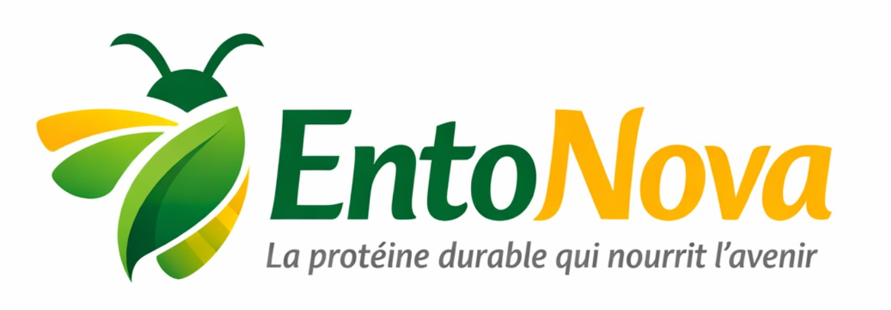

# Cas EntoNova
---
## 🏢 Contexte
EntoNova est une PME française spécialisée dans la production de protéines d’insectes à destination de l’alimentation humaine.

En 2029, une nouvelle réglementation européenne impose un minimum de protéines issues d’insectes dans les plats transformés.
- La demande explose.
- L’entreprise change d’échelle.
- Les données s’accumulent.

## 📈 La situation aujourd’hui
EntoNova dispose de nombreuses données :
- production (lots, volumes, rendements),
- ventes (clients, contrats, commandes),
- stocks et qualité,
- données financières.  
Mais…  
- les fichiers sont dispersés,
- les analyses sont manuelles,
- les indicateurs sont longs à produire,
- les décisions sont retardées

## ❓ Les questions de la direction

- Peut-on anticiper la demande ?
- Quels clients sont les plus stratégiques ?
- Les rendements de production sont-ils stables ?
- Les données sont-elles cohérentes et exploitables ?

## 🎯 Votre rôle

Vous intervenez comme analystes pour transformer les données d’EntoNova en informations utiles à la décision.

## 🛠️ Objectif du TP

Apprendre à utiliser Python pour :
- comprendre des données d’entreprise,
- les nettoyer et les analyser,
- produire des indicateurs fiables,
